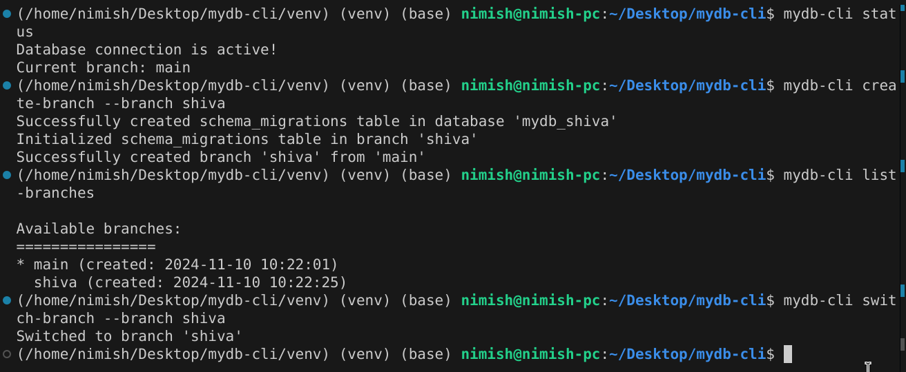

# MyDB CLI Tool [draft]

MyDB is a powerful database management tool that provides Git-like branching functionality for MySQL databases. It allows developers to create isolated database environments, manage migrations, and merge changes between branches.

📚 Related Documentation:
- [MyDB Landing Page](landingREADME.md)
- [MyDB Studio Documentation](studioREADME.md)

## Table of Contents
- [Features](#features)
- [Prerequisites](#prerequisites)
- [Installation](#installation)
- [Getting Started](#getting-started)
- [Usage](#usage)
  - [Branch Management](#branch-management)
  - [Table Operations](#table-operations)
  - [Migration Management](#migration-management)
  - [GUI Interface](#gui-interface)
- [Screenshots](#screenshots)
- [Contributing](#contributing)
- [License](#license)

## Features

- 🌳 Git-like branching for databases
- 📊 Table creation and management
- 🔄 Database migrations with up/down support
- 🔀 Branch merging capabilities
- 📱 GUI interface via MyDB Studio
- 🔒 Automated schema tracking
- 📝 Detailed migration history

## Prerequisites

- Python 3.7+
- MySQL Server 5.7+ or 8.0+
- pip (Python package manager)

## Installation

1. Clone the repository:
```bash
git clone https://github.com/yourusername/mydb-cli.git
cd mydb-cli
```

2. Create and activate a virtual environment (recommended):
```bash
python -m venv venv
source venv/bin/activate  # On Windows: venv\Scripts\activate
```

3. Install the package in development mode:
```bash
pip install -e .
```

4. Install required dependencies:
```bash
pip install -r requirements.txt
```

5. Make the CLI tool accessible system-wide:
```bash
# Add to your .bashrc or .zshrc:
export PATH="$PATH:/path/to/mydb-cli/bin"

# On Windows, add the bin directory to your system PATH
```

## Getting Started

1. Initialize your database configuration:
```bash
mydb-cli status
```
This will create a default configuration file at `.mydb/config.json`.

2. Update the configuration file with your MySQL credentials:
```json
{
    "connection": {
        "user": "your_username",
        "password": "your_password",
        "host": "localhost",
        "port": 3306,
        "database": "your_database",
        "auth_plugin": "mysql_native_password"
    }
}
```

## Usage

### Branch Management

Create a new branch:
```bash
mydb-cli create-branch --branch dev
```

List all branches:
```bash
mydb-cli list-branches
```

Switch to a different branch:
```bash
mydb-cli switch-branch --branch dev
```

Delete a branch:
```bash
mydb-cli delete-branch --branch old_feature
```

Merge branches:
```bash
mydb-cli merge-branch --source feature --target main
```

### Table Operations

Create a new table:
```bash
mydb-cli create-table --name users
# Follow the interactive prompts to define columns
```

List all tables:
```bash
mydb-cli list-tables
```

Describe table structure:
```bash
mydb-cli describe-table --name users
```

Drop a table:
```bash
mydb-cli drop-table --name old_table
```

### Migration Management

Create a new migration:
```bash
mydb-cli create-migration --name add_users_table --description "Create users table with basic fields"
```

Apply migrations:
```bash
mydb-cli migrate-up          # Apply next pending migration
mydb-cli apply-migration --number 1  # Apply specific migration
```

Rollback migrations:
```bash
mydb-cli migrate-down  # Rollback last applied migration
```

Check migration status:
```bash
mydb-cli migration-status
```

### GUI Interface

Launch the MyDB Studio interface:
```bash
mydb-cli studio
```

## Screenshots

### Branch Management



### Migration Status


### MyDB Studio


## Project Structure

```
.
├── LICENSE
├── README.md
├── assets
│   ├── index-BKO7flFT.css
│   └── index-D0-aluUL.js
├── image-1.png
├── image.png
├── index.html
├── main.py
├── migrations/
├── requirements.txt
├── streamlit.png
├── studio.py
├── testsqlcode01.txt
├── testsqlcode02.txt
└── vite.svg

```

## Contributing

1. Fork the repository
2. Create your feature branch (`git checkout -b feature/amazing-feature`)
3. Commit your changes (`git commit -m 'Add some amazing feature'`)
4. Push to the branch (`git push origin feature/amazing-feature`)
5. Open a Pull Request

## License

This project is licensed under the BSD 3-Clause License - see the [LICENSE](LICENSE) file for details.
This would allow me to make some features of this tool to be served on a proprietory basis as well where i'll earn by providing subscriptions for my dev tool features.

## Support

If you encounter any issues or have questions, please [open an issue](https://github.com/nimish-nimishmittal/mydb-cli/issues) on GitHub.
