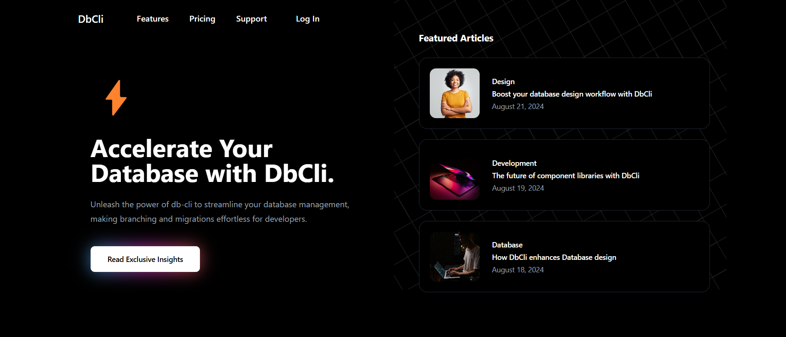
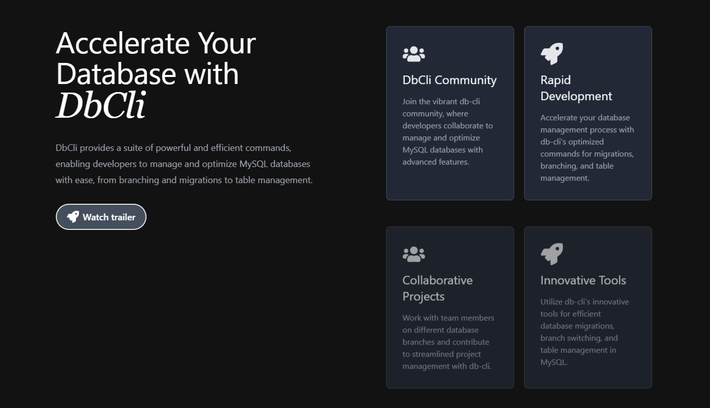

# sqldb-cli
This is a repository made for implementing database operations on mysql in the form of branches just like git. #htf24

## Introduction
sqldb-cli is a command-line tool designed to manage MySQL databases with branching functionality, similar to version control systems like Git. It allows you to create, switch, and manage database branches, apply migrations, and perform various database operations.

## Features
- **Branching**: Create, switch, and delete database branches effortlessly.
- **Migrations**: Apply, rollback, and manage migrations for different branches.
- **Table Management**: Create, describe, and drop tables within branches.
- **Status Checks**: Monitor the status of your database connection and migrations.

## Advantages
- **Version Control**: Manage your database schema changes with the same ease as code changes.
- **Isolation**: Work on different features or fixes in isolated branches without affecting the main database.
- **Flexibility**: Easily switch between branches to test different versions of your database schema.
- **Efficiency**: Streamline your database development workflow with powerful command-line tools.

## Commands:
apply-migration: Apply a specific or next pending migration.
create-branch: Create a new database branch.
create-migration: Create a new migration for the current branch.
create-table: Create a new table in the current branch.
delete-branch: Delete a database branch.
describe-table: Show detailed information about a specific table.
drop-table: Drop a table from the current branch.
list-branches: List all available branches.
list-tables: List all tables in the current branch.
migrate-down: Rollback the last applied migration.
migrate-up: Apply the next pending migration.
migration-status: Show status of all migrations in current branch.
status: Check the status of the database connection
switch-branch: Switch to a different database branch.

